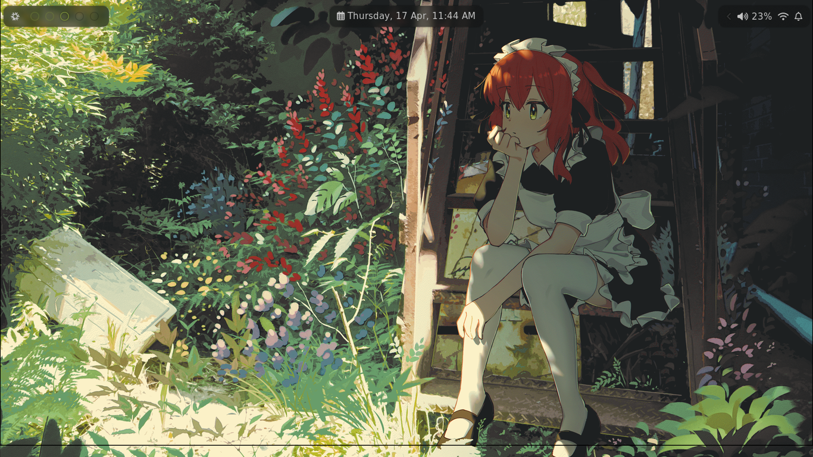
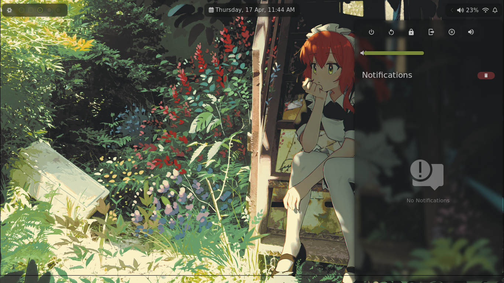
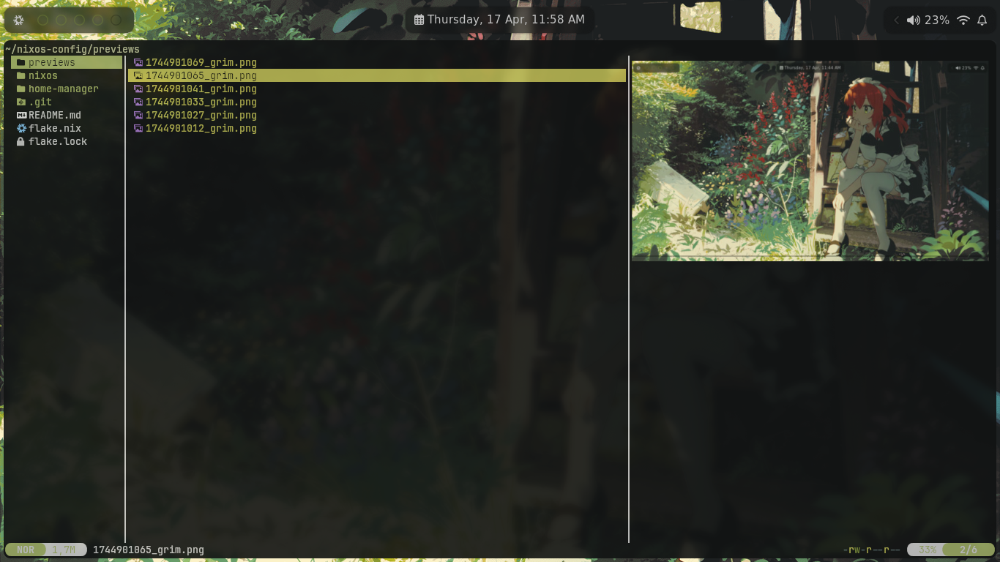
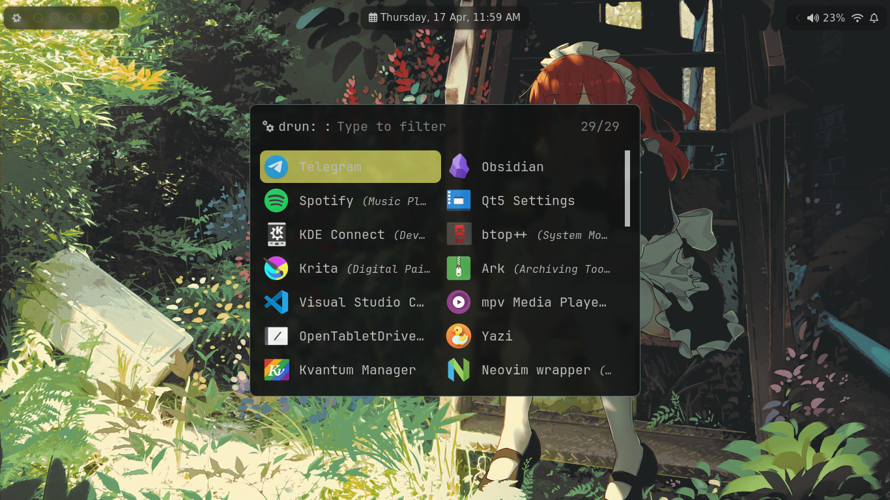
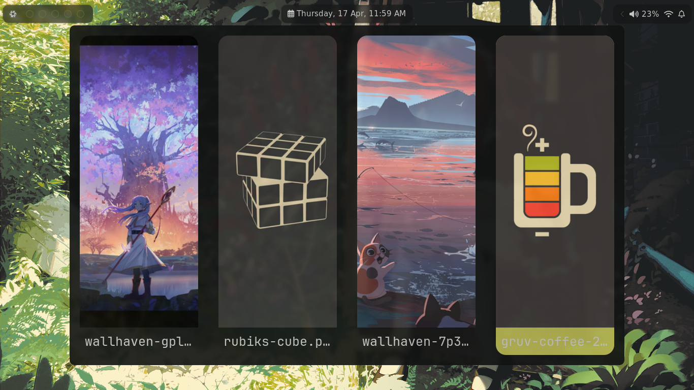
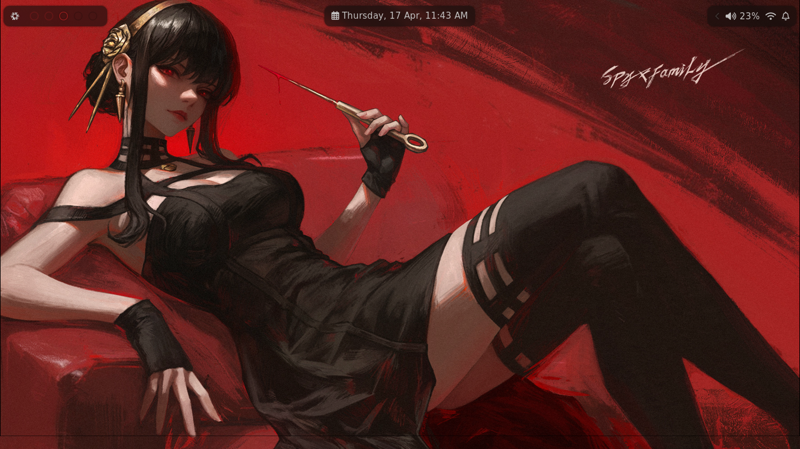
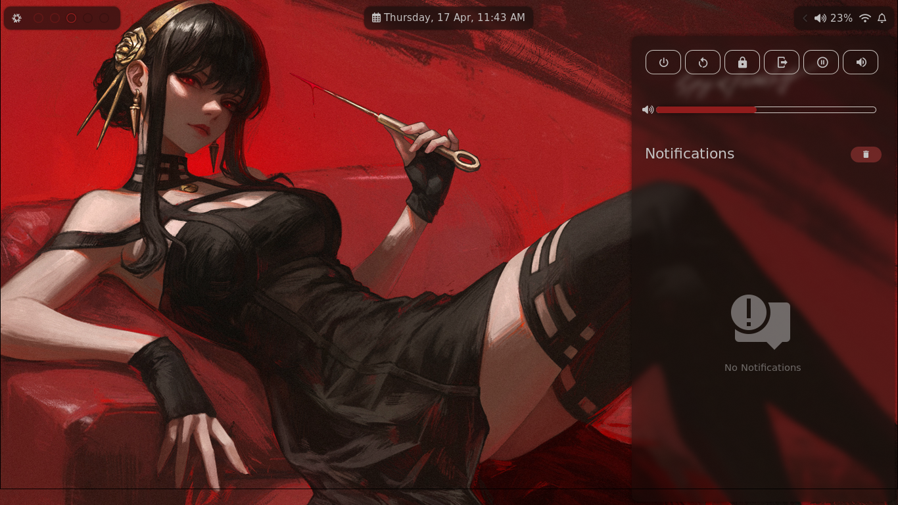
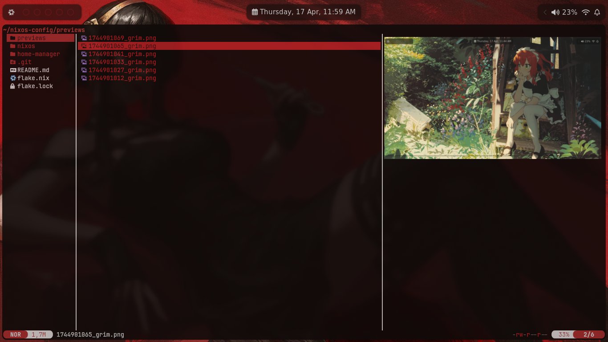
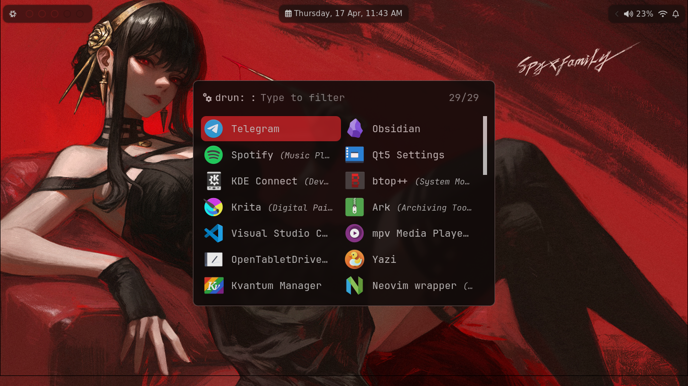
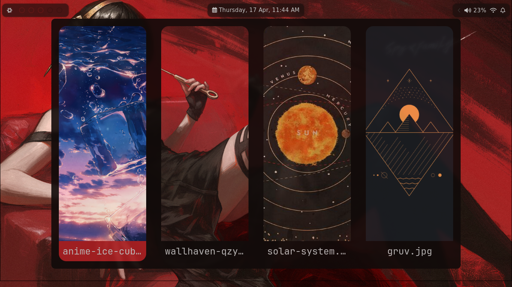

# My Nixos Config

My NixOs setup using <a href="https://github.com/eylles/pywal16">Pywal16</a> and Hyprland.
I used pywal16 to generate the colorscheme, and rofi to change the wallpaper.

## Dependencies
- Pywal16    
- Rofi       
- Hyprland   
- Waybar     
- Zsh        
- Oh My Zsh  
- Yazi       
- Zathura    
- Hyprlock   
- Swaync     
- Sddm       
## Previews

<table>
  <tr>
    <td></td>
    <td></td>
    <td></td>
    <td></td>
    <td></td>
  </tr>
  <tr>
    <td></td>
    <td></td>
    <td></td>
    <td></td>
    <td></td>
  </tr>
</table>
