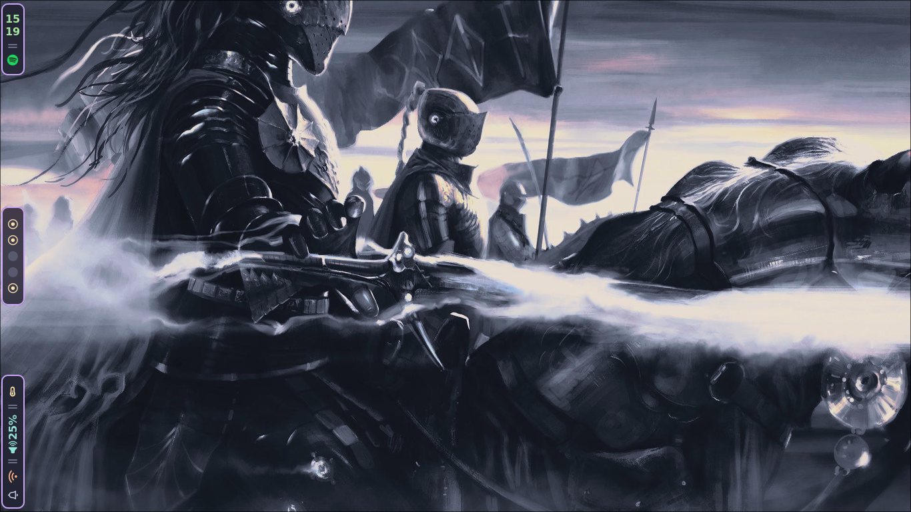
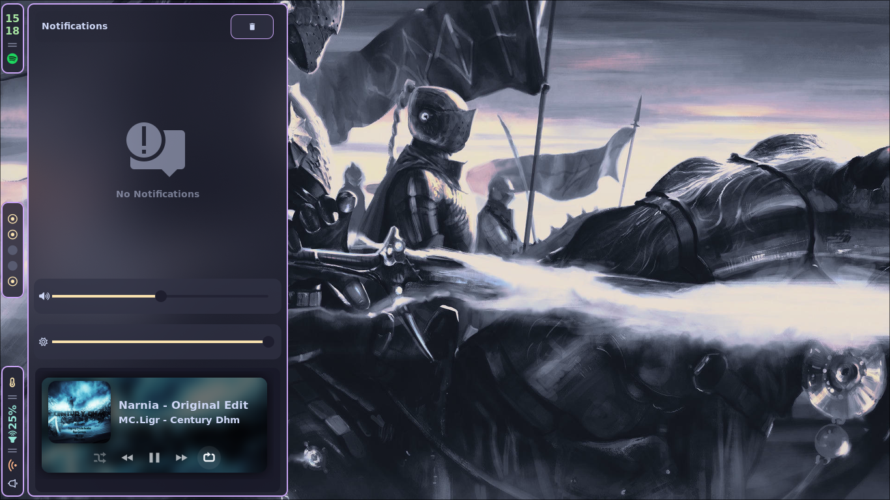
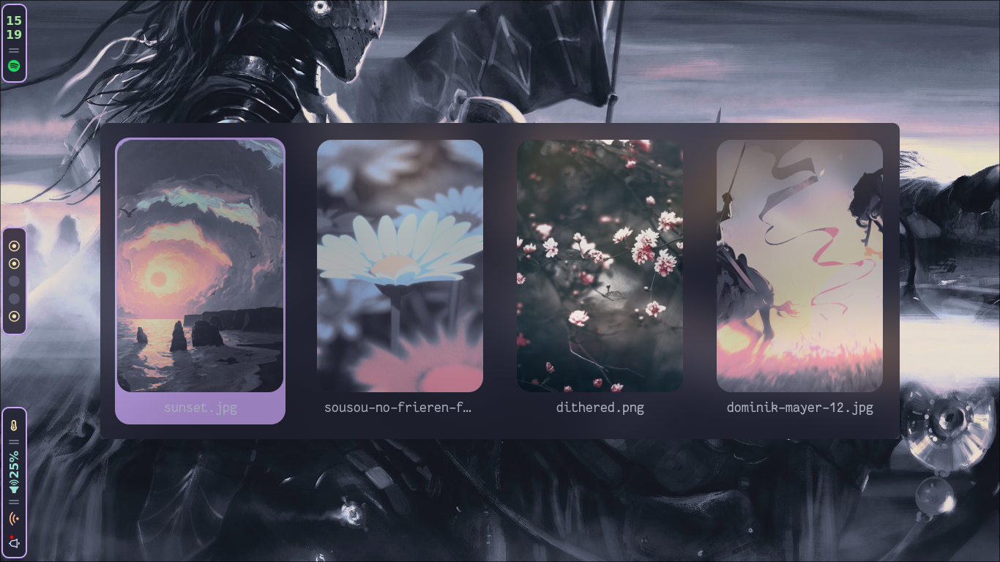
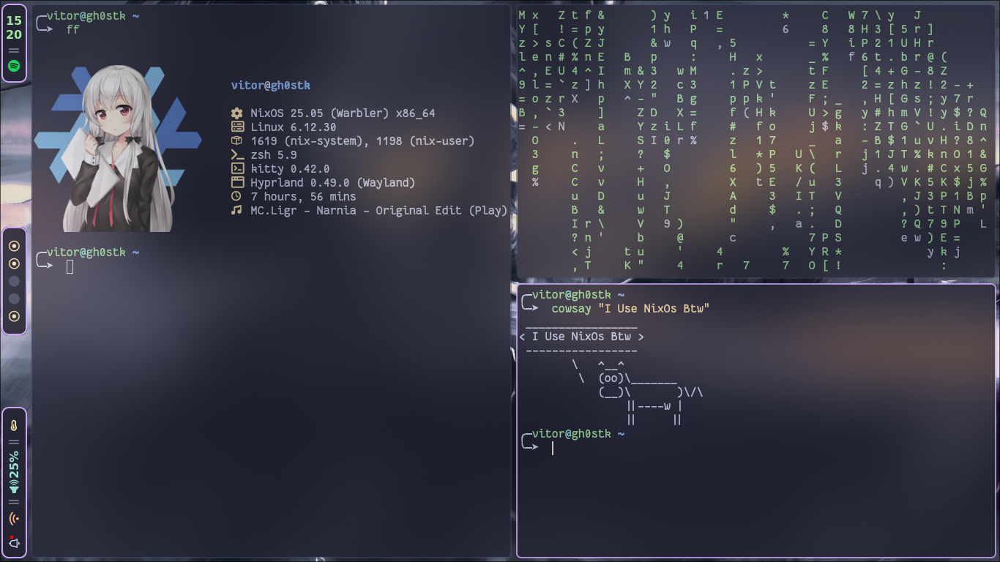

<div>
  <h1>My Nixos Config</h1>

  <p>My NixOs Catppuccin-Mocha-Mauve setup using <a href="">Hyprland</a> and with gruvbox-material theme.</p>

  <br>

  
  
  

</div>

## Content

1. [Previews](#previews)
2. [Keybinds](#keybinds)
3. [Dependencies](#dependencies)
4. [Requirements](#requirements)
5. [Quick Start](#quick-start)

## Notes

> <strong>Note:</strong> Hyprlock wallpaper is changed every time you change wallpaper
> <strong>Note:</strong> Digitizing table driver and installed

## Previews

<table>
  <tr>
    <td></td>
    <td></td>
  </tr>
  <tr>
    <td></td>
    <td></td>
  </tr>
</table>

## Keybinds
> <strong>Note:</strong> $mainMod is set to the SUPER key (usually the Windows key).

|Shortcut                      | Description                                             |                           
| ---------------------------  | ------------------------------------------------------- |
|$mainMod + Return             | Opens the terminal                                      |
|$mainMod + Shift + Return     | Opens a floating terminal with custom position and size |
|$mainMod + Q                  | Closes the active window                                |
|$mainMod + Shift + M          | Exits Hyprland                                          |
|$mainMod + E                  | Opens the file manager (Yazi)                           |
|$mainMod + T                  | Toggles the window between floating and tiled           |
|$mainMod + R                  | Toggles fullscreen                                      |
|$mainMod + A                  | Opens the launcher/menu (Rofi)                          |
|$mainMod +                    | Runs the custom power menu (Rofi)                       |
|$mainMod + P                  | Toggles pseudo-tile mode (dwindle)                      |
|$mainMod + J                  | Toggles horizontal/vertical split (dwindle)             |
|$mainMod + F                  | Opens the default browser (Brave)                       |
|$mainMod + Shift + F          | Opens the browser in incognito mode                     |
|$mainMod + C                  | Opens the default editor (Neovim)                       |
|$mainMod + Shift + C          | Opens the editor in a floating window                   |
|$mainMod + W                  | Changes the wallpaper (Rofi)                            |
|$mainMod + B                  | Restarts Waybar                                         |
|$mainMod + V                  | Manages clipboard (Rofi)                                |
|Insert                        | Opens screenshot menu (Rofi)                            |
|Ctrl + Shift + Insert         | Takes a screenshot of a selected area with grim+slurp   |

## Dependencies

- [Hyprland](https://github.com/hyprwm/Hyprland)
- [Waybar](https://github.com/Alexays/Waybar)
- [Rofi](https://github.com/davatorium/rofi)
- [Kitty](https://github.com/kovidgoyal/kitty)
- [Zsh](https://www.zsh.org/) + [Oh My Zsh](https://ohmyz.sh/)
- [Yazi](https://github.com/sxyazi/yazi)
- [Zathura](https://pwmt.org/projects/zathura/)
- [Swaync](https://github.com/ErikReider/SwayNotificationCenter)
- [Sddm](https://github.com/sddm/sddm)
- [Spicetify](https://github.com/spicetify/spicetify-cli)
- [Neovim](https://neovim.io/)
- [Visual Studio Code](https://code.visualstudio.com/)
- [Spotify](https://www.spotify.com/)
- [Brave](https://brave.com/)
- [Firefox](https://www.mozilla.org/firefox/)
- [Telegram](https://desktop.telegram.org/)
- [Lazygit](https://github.com/jesseduffield/lazygit)
- [Git-Delta](https://github.com/dandavison/delta)
- [Docker](https://www.docker.com/)
- [DBeaver](https://dbeaver.io/)
- [Obsidian](https://obsidian.md/)
- [Krita](https://krita.org/)
- [Discord](https://discord.com/)
- [OpenShot](https://www.openshot.org/)
- [PrismLauncher](https://prismlauncher.org/)
- [MPV](https://mpv.io/)
- [KDE Connect](https://kdeconnect.kde.org/)

## Requirements

- Git

## Quick Start

```bash
    git clone https://github.com/viitorags/nixos-config.git

    cd nixos-config

    sudo nixos-rebuild switch --flake .#gh0stk
    home-manager switch --flake .#gh0stk
```
