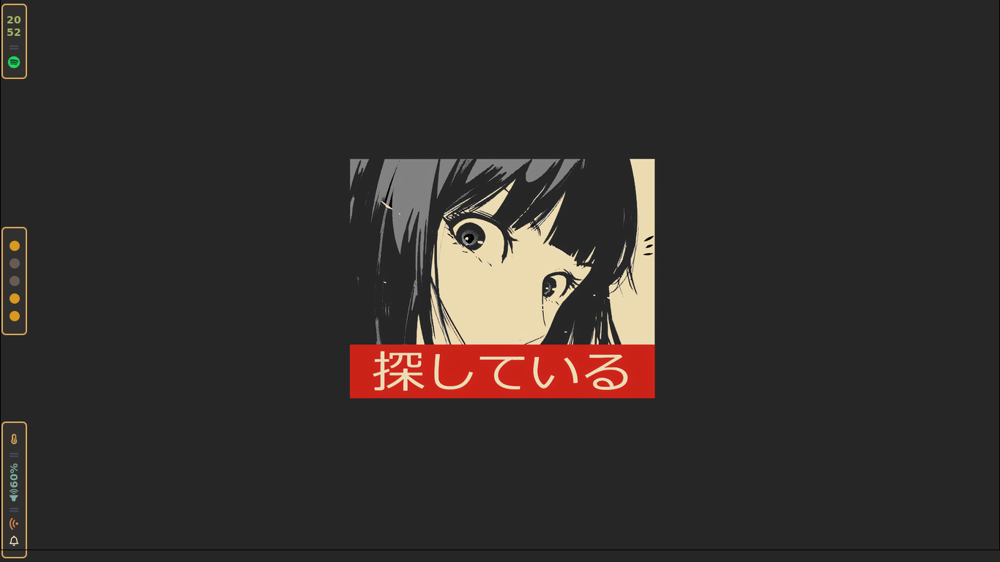
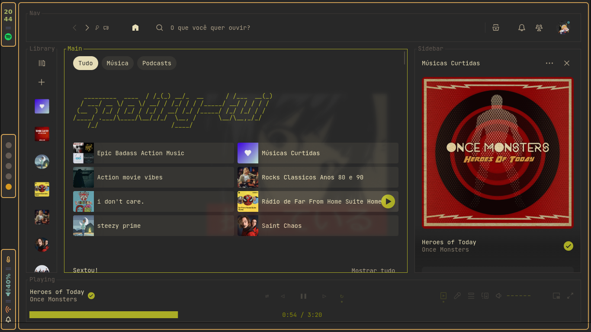
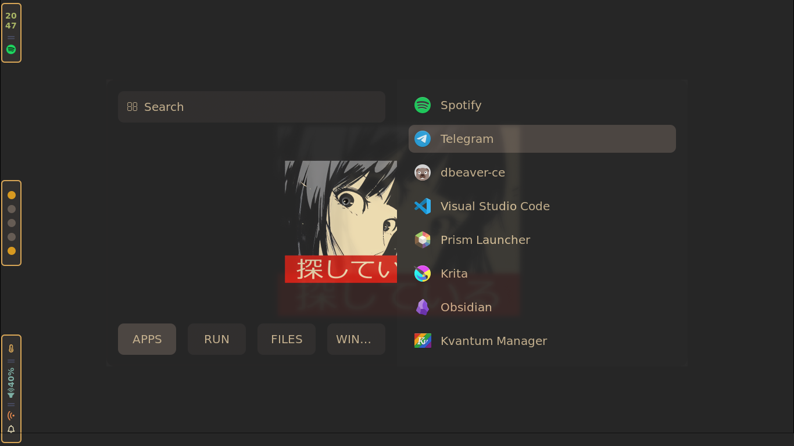
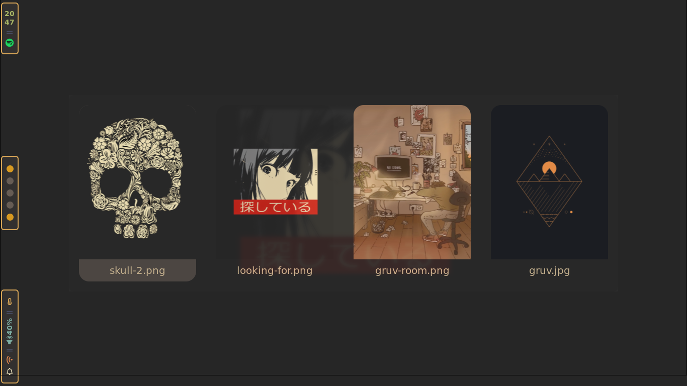
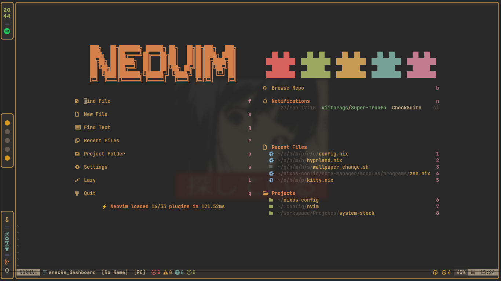

# My Nixos Config

My NixOs Tokyo Night setup using <a href="">Hyprland</a> and with gruvbox-material theme.

## Dependencies

- Rofi
- Hyprland
- Waybar
- Zsh
- Oh My Zsh
- Yazi
- Zathura
- Hyprlock
- Swaync
- Sddm
- Spicetify-Nix

## Previews

<table>
  <tr>
    <td></td>
    <td></td>
  </tr>
  <tr>
    <td></td>
    <td></td>
  </tr>
  <tr>
    <td></td>
    <td></td>
  </tr>
</table>
